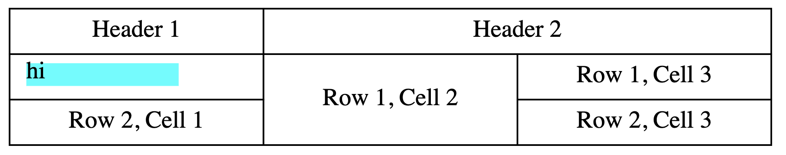
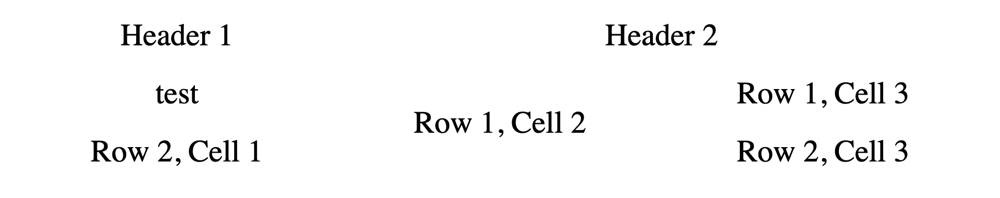
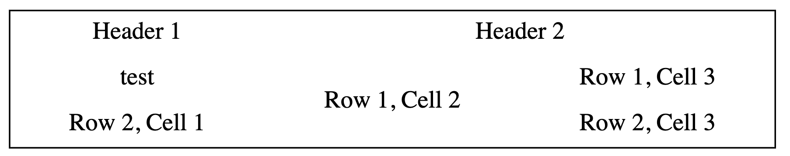
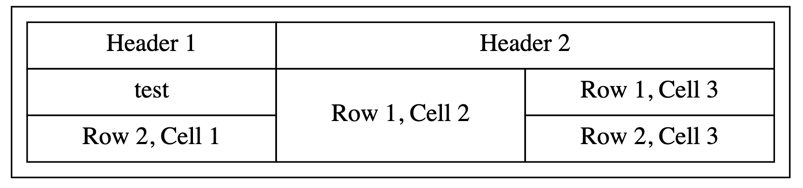
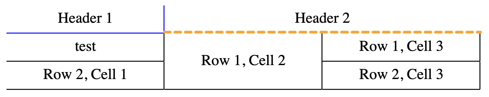
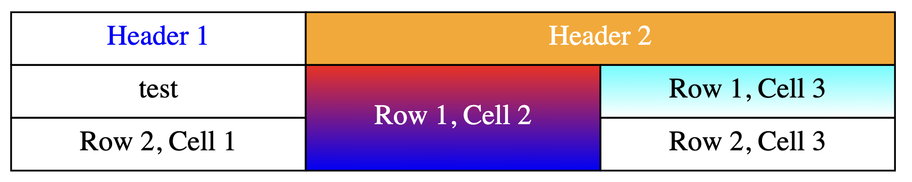
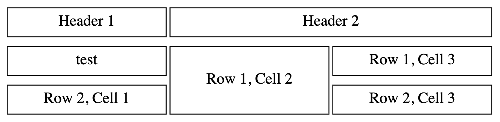
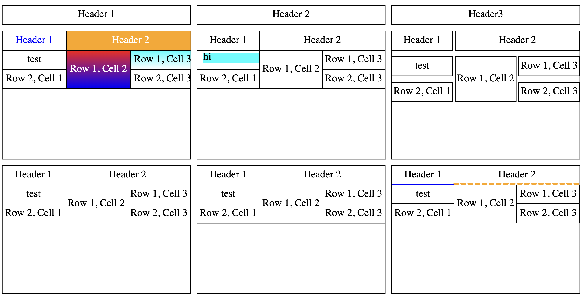
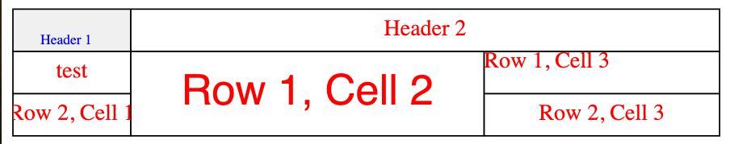
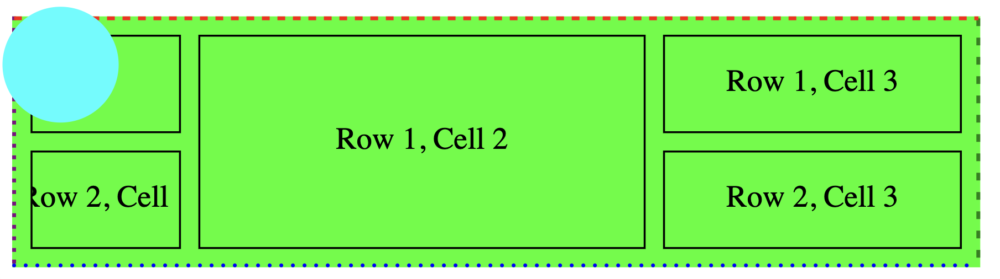

# Demo for svg-table

## Basic table

simply creating row/cells object and pass it to SVGTable element to create a svg table.

```typescript
import SVGTable, { TableProps }from '@shjeon0730/svg-table-vanilla';

const Rect = () => {
 return (
  <g>
   <rect x={10} y={5} width={100} height={15} fill='cyan' />
   <text x={10} y={15}>
    hi
   </text>
  </g>
 );
};

const BasicDemo = ({ width = 500 }: { width?: number }) => {
 const tableProps: TableProps = {
  width: width,
  rows: [
   {
    cells: [
     {
      content: 'Header 1',
     },
     {
      content: 'Header 2',
      colSpan: 2,
     },
    ],
   },
   {
    cells: [
     { content: <Rect /> },
     { content: 'Row 1, Cell 2', rowSpan: 2 },
     { content: 'Row 1, Cell 3' },
    ],
   },
   {
    cells: [
     { content: 'Row 2, Cell 1' },
     { content: 'Row 2, Cell 3' },
    ],
   },
  ],
 };

 return <SVGTable {...tableProps} />;
};

export default BasicDemo;

```



## No border Table

you can remove all borders.

```typescript
import SVGTable, { TableProps }from '@shjeon0730/svg-table-vanilla';

const NoBorderTableDemo = ({ width = 500 }: { width?: number }) => {
 const tableProps: TableProps = {
  width: width,
  defaultCellStyle: {
   borderWidths: 0,
  },
  rows: [
   {
    cells: [
     {
      content: 'Header 1',
     },
     {
      content: 'Header 2',
      colSpan: 2,
     },
    ],
   },
   {
    cells: [
     { content: 'test' },
     { content: 'Row 1, Cell 2', rowSpan: 2 },
     { content: 'Row 1, Cell 3' },
    ],
   },
   {
    cells: [
     { content: 'Row 2, Cell 1' },
     { content: 'Row 2, Cell 3' },
    ],
   },
  ],
 };

 return <SVGTable {...tableProps} />;
};

export default NoBorderTableDemo;


```



## table border

you can wrap the table with border

```typescript
import SVGTable, { TableProps }from '@shjeon0730/svg-table-vanilla';

const OnlyTableBolder = ({ width = 500 }: { width?: number }) => {
 const tableProps: TableProps = {
  width: width,
  defaultCellStyle: {
   borderWidths: 0,
  },
  style: {
   borderWidths: 1,
  },
  rows: [
   {
    cells: [
     {
      content: 'Header 1',
     },
     {
      content: 'Header 2',
      colSpan: 2,
     },
    ],
   },
   {
    cells: [
     { content: 'test' },
     { content: 'Row 1, Cell 2', rowSpan: 2 },
     { content: 'Row 1, Cell 3' },
    ],
   },
   {
    cells: [
     { content: 'Row 2, Cell 1' },
     { content: 'Row 2, Cell 3' },
    ],
   },
  ],
 };

 return <SVGTable {...tableProps} />;
};

export default OnlyTableBolder;


```



Or you can add margin between table cells and table border

```typescript
import SVGTable, { TableProps }from '@shjeon0730/svg-table-vanilla';

const TableBolderWithMargin = ({ width = 500 }: { width?: number }) => {
 const tableProps: TableProps = {
  width: width,

  style: {
   borderWidths: 1,
   margins: 10,
  },
  rows: [
   {
    cells: [
     {
      content: 'Header 1',
     },
     {
      content: 'Header 2',
      colSpan: 2,
     },
    ],
   },
   {
    cells: [
     { content: 'test' },
     { content: 'Row 1, Cell 2', rowSpan: 2 },
     { content: 'Row 1, Cell 3' },
    ],
   },
   {
    cells: [
     { content: 'Row 2, Cell 1' },
     { content: 'Row 2, Cell 3' },
    ],
   },
  ],
 };

 return <SVGTable {...tableProps} />;
};

export default TableBolderWithMargin;

```



## table border styles

you can customize the shape and color of the borders

```typescript
import SVGTable, { TableProps }from '@shjeon0730/svg-table-vanilla';

const TableBorderStyles = ({ width = 500 }: { width?: number }) => {
 const tableProps: TableProps = {
  width: width,
  defaultCellStyle: {
   borderWidths: [0, 1, 1, 0], // since default border is black, should be hide before customize some borders.
  },
  rows: [
   {
    cells: [
     {
      content: 'Header 1',
      style: {
       borderColors: 'blue',
      },
     },
     {
      content: 'Header 2',
      colSpan: 2,
      style: {
       borderWidths: [0, 0, 3, 0], // cell level style will override default style.
       borderColors: 'orange',
       borderPatterns: [6, 5],
       borderShapes: 'round',
      },
     },
    ],
   },
   {
    cells: [
     { content: 'test' },
     { content: 'Row 1, Cell 2', rowSpan: 2 },
     { content: 'Row 1, Cell 3' },
    ],
   },
   {
    cells: [
     { content: 'Row 2, Cell 1' },
     { content: 'Row 2, Cell 3' },
    ],
   },
  ],
 };

 return <SVGTable {...tableProps} />;
};

export default TableBorderStyles;

```



## background and text color change

you can change background of the cells and table. Also, the text color can be changed as well

```typescript
import SVGTable, { TableProps }from '@shjeon0730/svg-table-vanilla';
const Gradients = () => {
 return (
  <>
   <linearGradient id='red-to-blue' x1='0' x2='0' y1='0' y2='1'>
    <stop offset='0%' stopColor='red' />
    <stop offset='100%' stopColor='blue' />
   </linearGradient>
   <linearGradient id='cyan-to-white' x1='0' x2='0' y1='0' y2='1'>
    <stop offset='0%' stopColor='cyan' />
    <stop offset='100%' stopColor='white' />
   </linearGradient>
  </>
 );
};
const BgColorAndTextColor = ({ width = 500 }: { width?: number }) => {
 const tableProps: TableProps = {
  width: width,
  defs: <Gradients />,
  rows: [
   {
    cells: [
     {
      content: 'Header 1',

      style: {
       textColor: 'blue',
      },
     },
     {
      content: 'Header 2',
      colSpan: 2,
      style: {
       bgColor: 'orange',
       textColor: 'white',
      },
     },
    ],
   },
   {
    cells: [
     { content: 'test' },
     {
      content: 'Row 1, Cell 2',
      rowSpan: 2,
      style: {
       bgColor: 'url(#red-to-blue)',
       textColor: 'white',
      },
     },
     {
      content: 'Row 1, Cell 3',
      style: {
       bgColor: 'url(#cyan-to-white)',
      },
     },
    ],
   },
   {
    cells: [
     { content: 'Row 2, Cell 1' },
     { content: 'Row 2, Cell 3' },
    ],
   },
  ],
 };

 return <SVGTable {...tableProps} />;
};

export default BgColorAndTextColor;


```



## Gaps between columns and rows

you can easily add gaps between rows or columns.

```typescript
import SVGTable, { TableProps }from '@shjeon0730/svg-table-vanilla';

const Gaps = ({ width = 500 }: { width?: number }) => {
 const tableProps: TableProps = {
  width: width,
  style: {
   colGaps: 4,
   rowGaps: 10,
  },
  rows: [
   {
    cells: [
     {
      content: 'Header 1',
     },
     {
      content: 'Header 2',
      colSpan: 2,
     },
    ],
   },
   {
    cells: [
     { content: 'test' },
     { content: 'Row 1, Cell 2', rowSpan: 2 },
     { content: 'Row 1, Cell 3' },
    ],
   },
   {
    cells: [
     { content: 'Row 2, Cell 1' },
     { content: 'Row 2, Cell 3' },
    ],
   },
  ],
 };

 return <SVGTable {...tableProps} />;
};

export default Gaps;

```



## table in table

since this is just an svg, you can use another svg even svg-table.
But becareful. the columnWidths given is used just to calculate ratio of each columns. when you give colGaps, each columns' sizes are calculated excluding gaps (and margins).
so you should give widths for internal table considering of the gaps.
for example, if width of the table is 900, and 3 columns, the internal object's size cannot be more than 300.
but if you add colGaps as 10, then 900-20 = 880 is your total available size.
so each column will have 880/3 = 293 will be the available cell's width.

```typescript
import SVGTable, { TableProps }from '@shjeon0730/svg-table-vanilla';
import BasicDemo from './BasicDemo';
import BgColorAndTextColor from './BgColorAndTextColor';
import Gaps from './Gaps';
import NoBorderTableDemo from './NoBorderTableDemo';
import OnlyTableBolder from './OnlyTableBolder';
import TableBorderStyles from './TableBorderStyles';

const EmbeddedTable = () => {
 const tableProps: TableProps = {
  columnWidths: [1, 1, 1], // this is just ratio.
  width: 900,
  defaultRowStyle: {
   bgColor: 'yellow',
   height: 50,
  },

  style: {
   rowGaps: 10,
   colGaps: 10,
  },
  rows: [
   {
    style: {
     height: 30,
    },
    cells: [
     {
      content: 'Header 1',
     },
     {
      content: 'Header 2',
     },
     {
      content: 'Header3',
     },
    ],
   },
   {
    style: {
     height: 200,
    },
    cells: [
     { content: <BgColorAndTextColor width={300} /> }, // since there is gaps added, it will be overflow.
     { content: <BasicDemo width={293} /> },
     { content: <Gaps width={293} /> },
    ],
   },
   {
    style: {
     height: 200,
    },
    cells: [
     { content: <NoBorderTableDemo width={293} /> },
     { content: <OnlyTableBolder width={293} /> },
     { content: <TableBorderStyles width={293} /> },
    ],
   },
  ],
 };

 return <SVGTable {...tableProps} />;
};

export default EmbeddedTable;


```



## text override

svg-table has class names for individual elements. so you can add css.
but also, you can control individual text's attributes since the attributes are passed by `style.textStyle` option. All possible attributes can be passed to text elements.

using this behavior, we can override text's position, layout, and much more behavior.

in this example, I just overrode the positions of text.

```typescript
import SVGTable, { TableProps }from '@shjeon0730/svg-table-vanilla';

const textLeftTop = {
 textAnchor: 'start',
 dominantBaseline: 'hanging',
 x: 0,
 y: 0,
};

const TextStyleOverride = ({ width = 500 }: { width?: number }) => {
 const tableProps: TableProps = {
  columnWidths: [100, 300, 200],
  width: width,
  defaultCellStyle: {
   textColor: '#ff0000',
  },
  rows: [
   {
    cells: [
     {
      content: 'Header 1',
      style: {
       bgColor: '#f0f0f0',
       paddings: [10, 4, 0, 0],
       textColor: 'blue',
       textStyle: {
        textAnchor: 'middle',
        dominantBaseline: 'auto',
        fontSize: 10,
       },
      },
     },
     {
      content: 'Header 2',
      colSpan: 2,
      style: {
       textStyle: {
        textAnchor: 'middle',
        dominantBaseline: 'middle',
       },
      },
     },
    ],
   },
   {
    cells: [
     { content: 'test' },
     {
      content: 'Row 1, Cell 2',
      rowSpan: 2,
      style: {
       textStyle: {
        fontSize: 30,
        fontFamily: 'sans-serif',
       },
      },
     },
     {
      content: 'Row 1, Cell 3',
      style: {
       textStyle: textLeftTop,
      },
     },
    ],
   },
   {
    cells: [
     { content: 'Row 2, Cell 1' },
     { content: 'Row 2, Cell 3' },
    ],
   },
  ],
 };

 return <SVGTable {...tableProps} />;
};

export default TextStyleOverride;

```



## Play with styles even more

you can set more advanced styles on your svg.

```typescript
import SVGTable, { TableProps }from '@shjeon0730/svg-table-vanilla';

const Circle = () => {
 return <ellipse cx={15} cy={15} rx={30} ry={30} fill='cyan' />;
};

const TableStyles = ({ width = 500 }: { width?: number }) => {
 const tableProps: TableProps = {
  columnWidths: [100, 300, 200],
  width: width,

  defaultRowStyle: {
   bgColor: 'yellow',
   height: 50,
  },

  style: {
   // table's border customizations
   rowGaps: 10,
   colGaps: 10,
   margins: [10, 10, 10, 10],
   bgColor: 'lime',
   borderWidths: [2, 2, 2, 2],
   borderColors: ['red', 'green', 'blue', 'purple'],
   borderPatterns: [
    [4, 4],
    [4, 6],
    [0, 6],
    [0, 6],
   ],
   borderShapes: ['butt', 'butt', 'round', 'square'],
  },
  rows: [
   {
    cells: [
     {
      content: <Circle />,
      style: {
       svgStyle: {
        overflow: 'visible', // override internal svg's style
       },
      },
     },
     { content: 'Row 1, Cell 2', rowSpan: 2 },
     { content: 'Row 1, Cell 3' },
    ],
   },
   {
    cells: [
     { content: 'Row 2, Cell 1' },
     { content: 'Row 2, Cell 3' },
    ],
   },
  ],
 };

 return <SVGTable {...tableProps} />;
};

export default TableStyles;

```

by setting `overflow: visible` on the inner svg, we can make the content intentionally overflow.


